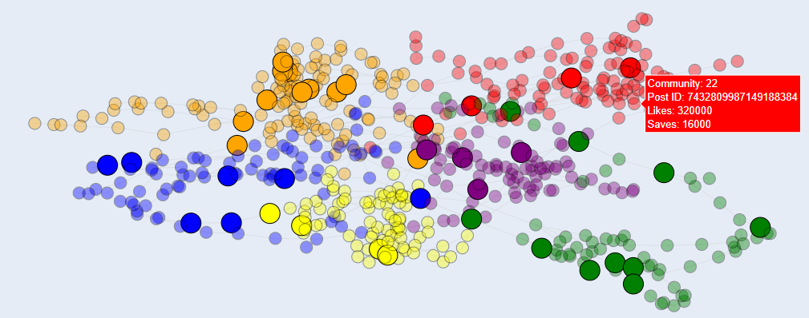
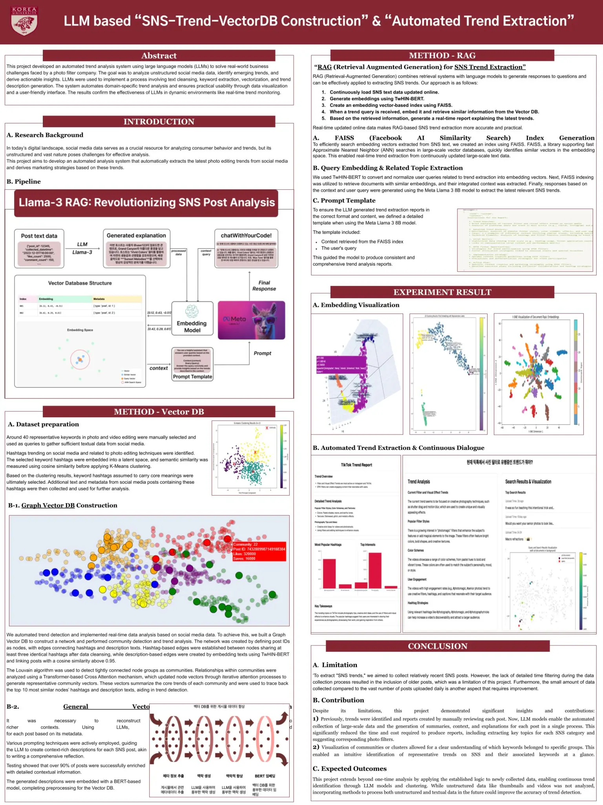

# SNS-trend-extraction-system

## 1. Summary

This project aims to build a system for analyzing and predicting trends using SNS data. Post IDs were defined as nodes, and connections between nodes were created based on hashtag and description data to form a graph network. Through this approach, community detection and trend keyword extraction were performed, and a Transformer-based Cross-Attention mechanism was applied to learn representative keywords for each community. This method effectively identifies popular content and trends on SNS and provides a robust analytical framework for real-time trend prediction.

## 2. Goal

The goal of this project was to transform SNS data into a graph structure and store it in a vector database to build a model capable of real-time trend analysis and prediction. This approach aimed to understand popular content and trends on SNS platforms while effectively detecting the data patterns emerging within them.

## 3. Process

### 3-1. Data Collection

  

Data Collection

SNS post data was crawled to collect information such as post ID, uploader, upload date, description, hashtags, number of likes, number of comments, and number of saves. Ultimately, the key data used for the analysis are as follows.

- **post_id**: Utilized as nodes in the network.
- **hashtags and description**: Used to create edges representing connections between nodes.
- **like_count and save_count**: Leveraged as indicators for trend analysis and visualization.

### 3-2. Data Analysis

**Network Creation and Graph Vector DB Construction**

- **Definition of Nodes and Edges**
  - **Nodes** : Each post’s post_id was designated as a node in the network, with each node representing an individual post.
  - **Edges**: Connections (edges) between nodes were created based on hashtags and descriptions. Each data type was processed as follows:
    - **Hashtag-based Edges**: Edges were created between posts sharing three or more identical hashtags. Hashtags were converted to lowercase and filtered to remove unnecessary keywords (e.g., fyp, viral).
    - **Description-based Edges**: Post descriptions were vectorized using the TwHIN-BERT model. Cosine similarity was calculated between vectors, and edges were formed between posts with a similarity score of 0.95 or higher, reflecting semantic relationships in the content.

- **Hashtag-based Edge Generation**
  - **Data Preprocessing**:
    - Converted hashtags to lowercase for uniformity.
    - Removed duplicate and irrelevant hashtags (e.g., fyp, viral).
  - **Edge Creation Criteria**:
    - Edges were established between posts sharing three or more identical hashtags.
    - This process captured the shared context and formed trend-relevant groupings.

- **Description-based Edge Generation**
  - **Text Vectorization**:
    - Descriptions were transformed into numerical vectors using TwHIN-BERT, a multilingual language model trained on diverse Twitter datasets. This model effectively represents text meaning and social interactions.
  - **Similarity Calculation**:
    - Cosine similarity between vectors was calculated to evaluate content similarity.
    - Edges were created between posts with a similarity score of 0.95 or higher, enabling connections based on shared semantic context.
  - **Outcome**:
    - Description-based edges strengthened relationships between posts with similar themes or contexts.

- **Graph Construction and Vector DB Storage**
  - **Network Creation**:
    - Nodes and edges were linked using igraph, resulting in a SNS data-based graph.
    - Node attributes such as like_count and save_count were included for future visualization and analysis.
  - **Graph Vector DB Construction**:
    - The graph data was converted into a vector database.
    - Each node was represented as a vector (embedding), enabling efficient similarity analysis and search functionalities.
   
  
**Community Detection and Trend Analysis**

- **Community Detection**
  - **Louvain Algorithm**:
    - Applied the Louvain algorithm to detect communities within the network. Each community represents a cluster of nodes with high connection density, indicative of trend groups or thematic clusters.
  - **Selection of Valid Communities**:
    - Only communities with 70 or more nodes were considered valid for analysis. Analyzed the relationships and connections within these communities to identify key trend keyword groups.

- **Cross Attention-Based Analysis**
  - **Use of Transformer Blocks**:
    - Implemented Cross Attention to learn relationships among nodes within each community.
    - Transformer blocks emphasized connections between high-importance nodes, enhancing the representation of critical relationships.
  - **Representative Vector Creation**:
    - Generated a representative vector for each community using the Cross Attention process.
    - The representative vector encapsulates the overall context of the community and serves as a basis for trend analysis.
  - **Trend Keyword Extraction**:
    - Identified post descriptions and hashtags most similar to the representative vector.
    - Extracted keywords represent dominant trends within each community and can be utilized for future trend prediction.
   
## 4. Result

### 4-1. Visualization

  

Visualization

The detected communities were visually distinguished using unique colors, enabling a clear representation of the network structure and differences between groups. To differentiate influencer posts (nodes) from general user posts, the transparency of node colors was adjusted. This distinction made it possible to identify communities where influencer nodes were concentrated, offering insights into the initial stages of trend formation or the potential for general user engagement.

Interactive visualization was implemented, allowing users to click on individual nodes to view specific details such as the number of likes and saves for each post. This interactive feature provides an intuitive way to analyze and interpret network data.

### 4-2. Community Topics and Keyword Extraction

<table style="width: 80%; text-align: center;">
  <thead>
    <tr>
      <th>Community ID</th>
      <th>Number of Nodes</th>
    </tr>
  </thead>
  <tbody>
    <tr>
      <td>Community 53</td>
      <td>87</td>
    </tr>
    <tr>
      <td>Community 21</td>
      <td>81</td>
    </tr>
    <tr>
      <td>Community 10</td>
      <td>80</td>
    </tr>
    <tr>
      <td>Community 14</td>
      <td>76</td>
    </tr>
    <tr>
      <td>Community 17</td>
      <td>76</td>
    </tr>
    <tr>
      <td>Community 2</td>
      <td>73</td>
    </tr>
    <tr>
      <td>Community 7</td>
      <td>72</td>
    </tr>
    <tr>
      <td>Community 27</td>
      <td>72</td>
    </tr>
    <tr>
      <td>Community 23</td>
      <td>71</td>
    </tr>
  </tbody>
</table>

  

Community Topics and Keyword Extraction

Extracted community information includes the community name, the number of nodes it contains, and viral metrics. Viral metrics are quantified as the total number of likes across posts within a community, offering a measurable indicator of the community’s popularity.

Additionally, by leveraging the Cross Attention method, the top five nodes most similar to the representative vector were identified. These nodes highlight the dominant keywords within each community, reflecting the primary trends.

This approach provides a robust foundation for analyzing and predicting the key interests and trends of each community, aiding in effective trend tracking and forecasting.

  

